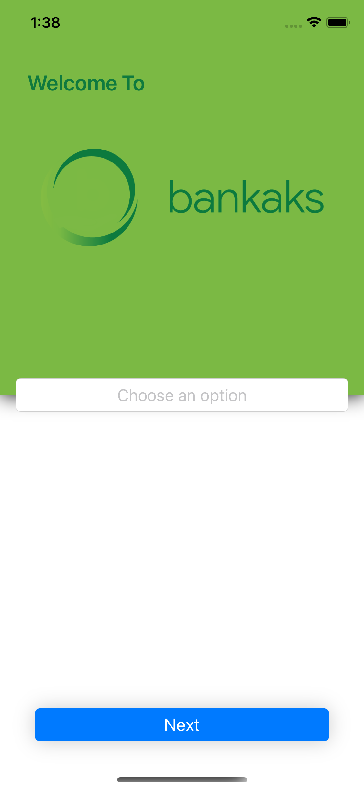
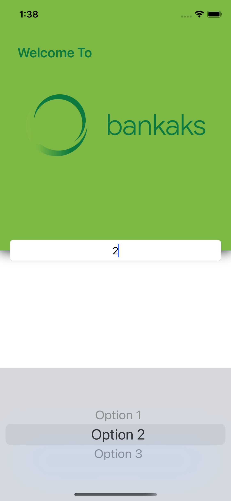
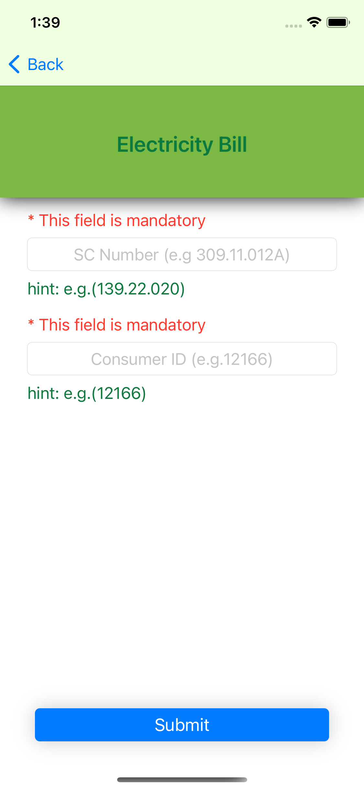

# Bankaks-Assessment

iOS project for the Bankaks open iOS Dev position assessment where the participant has to consume from an API and build a dynamic form based on the data retrieved.

## Gif:

## ScreenShots:

## Technologies used:
### Design patters:
  - Composer
  - Builder
  - Observer
  - Delegation

### Arquitecture used:
  - MVVM-C
  
### Others:
  - Error Handling
  - Auto-Layout
  - Collection View
  - View Code
  - Threads
  - Animation
  - Extensions
  - Api request
  - Loading screen
  - GitFlow
